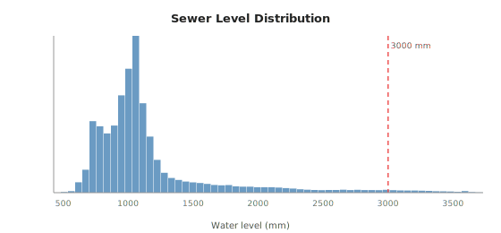

# Sewer Overflow Prediction — DO08 Lion (Brussels)

Predicting sewer water levels at the **Lion overflow location (DO08)** in Brussels **15 minutes (t+15) and 60 minutes (t+60) ahead**, using rainfall and historical sewer-level data. Overflow occurs when the water level exceeds **3000 mm**.

---

## Dataset

| Source | Files | Resolution | Coverage |
|--------|-------|------------|----------|
| Pluviometer (FLOWBRU) | `2022.xlsx`, `2023.xlsx`, `2024.xlsx` | 5 min | 2022–2024 |
| Sewer level DO08 | `U24_2022.csv`, `U24_2023.csv`, `U24_2024.csv` | 1 min | 2022–2024 |

Two rain gauge stations: **Avant-Port (P01)** and **Flagey (P14)**.

> Raw data files are not tracked in this repository. Place them in `Pluviometer data/` and `Sewage data/` before running.

### Sewer level — full time series


### Rainfall — monthly totals per station


### Sewer level distribution



---

## Results

### Overflow event zoom (±12 h window)


| Metric | Value |
|--------|-------|
| Dataset span | 2022-01-01 → 2024-12-30 |
| 5-min timesteps (after merge) | 315,360 |
| Overflow readings (> 3000 mm) | ~30,000 (~10% of data) |
| Distinct overflow events | ~301 |
| Max recorded level | 3,731 mm |
| Max 5-min rainfall | 12.7 mm (Avant-Port) |

---

## Project Structure

```
Model.ipynb            # Main notebook — all steps end-to-end
step1_load_merge.py    # Standalone: load & inspect raw data
step2_clean_merge.py   # Standalone: clean, resample, merge
images/                # SVG visualizations used in this README
```

---

## Pipeline

### Step 1 — Load & Inspect
- Load all 3 yearly Excel files for rainfall and concatenate
- Load all 3 yearly CSV files for sewer levels and concatenate
- Print shape, dtypes, date range, and missing value counts

### Step 2 — Clean & Merge
- **Sewer (1-min):** remove negatives; resample to 5-min mean; linearly interpolate gaps ≤ 30 min; leave longer gaps as NaN
- **Rainfall (5-min):** clip negative values
- Merge both on the common 5-min index → `data_clean.parquet`
- Overflow event analysis: detect, gap-merge, and tabulate distinct overflow episodes

---

## Setup

```bash
pip install pandas numpy plotly openpyxl pyarrow
```

Python 3.11+ recommended.
